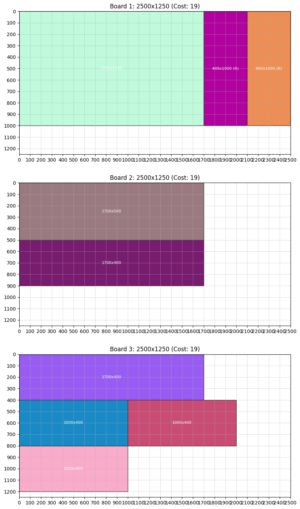

# Board Cutting Optimization and Purchasing

This project provides a heuristic solution for a 2D cutting stock problem. Given a list of required pieces (with dimensions and quantities) and a list of available board types (with dimensions and cost), the program finds a combination of boards that minimizes the total cost while being able to cut all required pieces. The solution uses a free-rectangle splitting algorithm for panel packing, a greedy heuristic based on cost per unit area of packed pieces, and produces both a shopping list of boards and visualizations of the board layouts.

# An NP-Hard problem

The board cutting problem, specifically when aiming to minimize the total cost of purchasing boards while ensuring all required pieces are cut, is NP-hard because it involves combinatorially selecting and packing pieces onto available boards in a way that optimizes the cost, subject to the constraints of the board dimensions. This problem shares characteristics with the bin packing problem, which is known to be NP-hard. In bin packing, the objective is to minimize the number of bins (or boards, in this case) required to pack a set of items (or pieces), and this becomes computationally difficult as the number of items and bins increases. The added complexity of minimizing the total cost, considering different board sizes and costs, further increases the difficulty. Since no known algorithm can solve NP-hard problems in polynomial time, finding the optimal solution for large input sizes becomes infeasible, and heuristics or approximation algorithms are used instead to find good-enough solutions within a reasonable time frame.

## Output

The program generates visualizations of the board layouts, showing how the pieces are arranged on each board. Below is an example of the output image:



## Features

- **Panel Packing:**  
  Uses a free-rectangle splitting algorithm to efficiently pack rectangular pieces onto a board. Pieces may be rotated if it improves the packing.

- **Cost Optimization:**  
  Chooses board types based on a heuristic metric (cost per unit area of packed pieces) to minimize overall cost.

- **Shopping List Generation:**  
  Prints a shopping list of boards needed, detailing the number of boards required for each board type, along with their dimensions and cost per board.

- **Visualization:**  
  Displays each board (using its full dimensions) along with the placed pieces. Each board’s subplot title shows the board number, its dimensions, and cost.

## Requirements

- Python 3.x
- [NumPy](https://numpy.org/)
- [Matplotlib](https://matplotlib.org/)
- [tqdm](https://github.com/tqdm/tqdm)

## Installation

1. **Clone the Repository** (or download the code file):

   ```bash
   git clone <repository-url>
   cd <repository-directory>
   ```

2. **Install the Required Packages:**

   Install dependencies via pip:

   ```bash
   pip install numpy matplotlib tqdm
   ```

## How to Use

### 1. Prepare Your Input Data

- **Required Pieces:**  
  Define a list of the pieces you need to cut. Each piece is a tuple in the format:

  ```
  (piece_width, piece_height, quantity)
  ```

  **Example:**

  ```python
  required_pieces = [
      (1000, 400, 5),   # 5 pieces of size 1000x400
      (1700, 400, 2),   # 2 pieces of size 1700x400
      (1700, 1000, 1),  # 1 piece of size 1700x1000
      (1700, 500, 1)    # 1 piece of size 1700x500
  ]
  ```

- **Available Board Types:**  
  Define a list of board types available for purchase. Each board is represented as a tuple:

  ```
  (board_width, board_height, cost)
  ```

  **Example:**

  ```python
  available_boards = [
      (2440, 1220, 45),  # A board of 2440x1220 costing 45
      (600, 300, 5),     # A board of 600x300 costing 5
      (800, 400, 9),     # A board of 800x400 costing 9
      (1200, 600, 14)    # A board of 1200x600 costing 14
  ]
  ```

### 2. Run the Program

In the main section of the script (guarded by `if __name__ == "__main__":`), the following occurs:

- The required pieces are expanded and sorted (largest first).
- The optimizer simulates packing for each available board type using a greedy heuristic.
- The board type with the lowest cost per packed area is selected.
- A cutting plan is generated, and a shopping list is produced.
- Finally, the boards and placements are visualized.

To run the program, execute:

```bash
python <filename>.py
```

### 3. View the Output

- **Total Cost and Shopping List:**  
  The program prints the total cost along with a shopping list detailing the number of boards needed for each board type, including dimensions and cost.

- **Cutting Plan:**  
  The cutting plan is printed as a list of placements. Each placement is a tuple:

  ```
  (x, y, w, h, board_number, rotated)
  ```

  indicating where on the board the piece is placed and whether it was rotated.

- **Visualization:**  
  A window appears showing each board at its full dimensions, including blank areas. Each subplot’s title displays the board number, dimensions, and cost.

## Code Structure

- **Panel Class:**  
  Implements the free-rectangle splitting algorithm. The `try_place` method attempts to place a given piece (with or without rotation) in one of the free rectangles and updates the free space accordingly.

- **optimize_purchase Function:**

  - **Input:** Lists of required pieces and available board types.
  - **Process:**
    - Expands the required pieces.
    - Sorts them by area (largest first).
    - Iteratively simulates packing on each board type using a greedy algorithm.
    - Chooses the board type with the lowest cost per unit area of packed pieces.
  - **Output:**
    - `cutting_plan`: Global list of placements across all boards.
    - `board_solution`: List of board types (each as `(width, height, cost)`) used.
    - `total_cost`: Total cost of boards purchased.

- **visualize_boards Function:**  
  Uses Matplotlib to display each purchased board at its full dimensions, including blank spaces. The board’s dimensions and cost are shown in the subplot title.

- **print_shopping_list Function:**  
  Aggregates and prints a shopping list from the board solution, listing the quantity of each board type required.

## Limitations and Future Improvements

- **Heuristic Nature:**  
  The problem is NP-hard; the greedy heuristic (based on cost per unit area of packed pieces) is not guaranteed to be optimal but works well for many practical scenarios.

- **Enhanced Free-Rectangle Management:**  
  Future enhancements might include merging or pruning free rectangles for better packing efficiency.

- **Advanced Optimization Techniques:**  
  Integrating more advanced methods (e.g., integer programming or metaheuristics) could further improve the solution for more complex cases.

## License

This project is licensed under the MIT License. See the [LICENSE](LICENSE) file for details.
